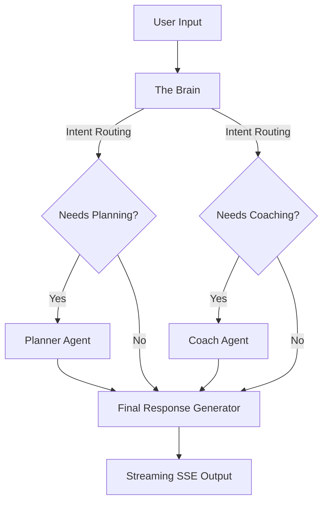

# ProDo ⚡
### Conversational AI Executive Assistant

[](https://www.python.org/)
[](https://nextjs.org/)
[](https://fastapi.tiangolo.com/)
[](https://deepmind.google/technologies/gemini/)

Prodo is an AI-powered executive assistant that feels like texting a smart, highly organized friend. Instead of interacting with complex dashboards or rigid forms, users talk to Prodo in natural language. It listens, thinks, schedules tasks intelligently, syncs with Google Calendar, tracks productivity streaks, and analyzes focus habits to optimize daily work routines.

---

## Table of Contents
1. [Core Features](#core-features)
2. [Architecture Overview](#architecture-overview)
3. [Agent & Cognitive Design](#agent--cognitive-design)
4. [Database & Memory Schema](#database--memory-schema)
5. [Scheduling Rules & Priority Matrix](#scheduling-rules--priority-matrix)
6. [API & SSE Streaming Protocol](#api--sse-streaming-protocol)
7. [Tech Stack](#tech-stack)

---

## Core Features

- **Natural Language Command Processing**: Text or speak to Prodo. The assistant automatically extracts tasks, deadlines, and durations.
- **Intelligent Scheduling & Conflict Resolution**: Automatically cross-references new tasks with existing commitments and proposes optimized, conflict-free slots.
- **Google Calendar OAuth Sync**: Real-time read and write integrations mapping Firestore task schedules directly onto a user's primary calendar.
- **Habits & Focus Logging**: Real-time metrics tracking location, focus scores, and distraction frequencies to learn peak performance hours.
- **Adaptive Coaching Insights**: Leverages historical logs (5+ entries required) to surface real peak hours and customize scheduling recommendations.
- **Productivity & Streak Tracker**: Daily scores (0-100) calculated dynamically based on tasks completed, focus hours, and streak parameters.
- **Premium Glassmorphic UI**: High-fidelity dark user interface built using Next.js 14, Tailwind CSS, and Framer Motion, with drag-and-drop task reordering.
- **SSE-Backed Thinking Feed**: Visual progress indicators streaming the exact step-by-step reasoning ("listening", "planning", "coaching", "responding") to the frontend.
- **Consolidated Weekly Memory**: Automatic weekly background agent that condenses conversation logs into long-term structured insights while purging raw data.

---

## Architecture Overview

Prodo splits responsibilities clean-cut between a Next.js 14 frontend and a FastAPI (Python 3.11) backend orchestrating specialized agents via LangGraph.

```
prodo/
├── backend/
│   ├── main.py                    # FastAPI routes, startup event loop, and SSE streaming pipeline
│   ├── agents/
│   │   ├── state.py               # Shared AgentState TypedDict
│   │   ├── brain.py               # Orchestrator & router agent (Decision node)
│   │   ├── planner.py             # Task extraction & calendar scheduling agent
│   │   ├── coach.py               # Habit analytics & performance scoring agent
│   │   └── memory_agent.py        # Weekly memory compression & log cleanup agent
│   ├── services/
│   │   ├── firestore_service.py   # Firestore read/write adapter (async)
│   │   ├── calendar_service.py    # Google Calendar API Client wrapper
│   │   └── gemini_service.py      # Configure google-generativeai client wrapper
│   ├── requirements.txt           # Python backend dependencies
│   └── Dockerfile                 # Slim-debian container build
│
├── frontend/
│   ├── app/
│   │   ├── page.tsx               # Primary dashboard interface & real-time chat interface
│   │   ├── layout.tsx             # Root layout settings
│   │   └── analytics/
│   │       └── page.tsx           # Charts (Recharts) mapping focus/streak history
│   ├── components/
│   │   ├── AuthInterface.tsx      # Firebase auth overlay
│   │   ├── ChatInterface.tsx      # Dynamic streaming chat + thinking states
│   │   ├── TaskPanel.tsx          # Draggable, interactive list view for task entries
│   │   ├── HabitLogger.tsx        # Session focus timer & metric logger
│   │   ├── ProductivityCard.tsx   # Streak indicator card
│   │   ├── ProfileModal.tsx       # User profile details and settings
│   │   └── VoiceInput.tsx         # Voice capability for web speech interface
│   ├── lib/
│   │   ├── firebase.ts            # Client SDK credentials & setup
│   │   ├── useStream.ts           # SSE custom React hook
│   │   └── types.ts               # Global TypeScript definitions
│   ├── tailwind.config.ts
│   └── package.json
```

---

## Agent & Cognitive Design

The agent network runs sequentially under the governance of **The Brain** orchestrator:



### 1. The Brain (Orchestrator)
- **Role**: Intent analysis and execution routing.
- **Mechanism**: Analyzes the raw user prompt, conversation history, and user's profile metadata. Emits boolean indicators specifying whether the request requires task planning/scheduling or coaching insights.

### 2. The Planner
- **Role**: Context-aware scheduling engine.
- **Mechanism**: Extracts tasks, durations, and deadlines. Queries Firestore for scheduling availability and overlays user patterns to locate optimal, conflict-free slots.

### 3. The Coach
- **Role**: Focus and scoring engine.
- **Mechanism**: Monitors habits and focus sessions. Calculates daily scores using the formula:
$$\text{Base Score} = \left( \frac{\text{Tasks Completed}}{\max(\text{Tasks Completed} + \text{Tasks Missed}, 1)} \right) \times 60$$
$$\text{Focus Bonus} = \min\left( \frac{\text{Focus Minutes}}{120}, 1.0 \right) \times 25$$
$$\text{Streak Bonus} = \min\left( \text{Streak Days} \times 2, 15 \right)$$
$$\text{Productivity Score} = \text{round}(\min(\text{Base Score} + \text{Focus Bonus} + \text{Streak Bonus}, 100))$$

### 4. The Memory Agent (Weekly Cron)
- **Role**: Data optimization and long-term personalization.
- **Mechanism**: Triggers via an interval scheduler every 7 days. Collates conversational history, runs synthesis via Gemini to extract permanent user attributes (e.g., preferences, recurrent blockers), saves findings to `long_term_memory`, and flushes raw historical text.

---

## Database & Memory Schema

Prodo utilizes Google Cloud Firestore as its state backend. The structure is configured as follows:

```
├── users/ {uid}
│   ├── displayName: string
│   ├── email: string
│   ├── calendarAccessToken: string
│   ├── calendarRefreshToken: string
│   ├── timezone: string
│   └── createdAt: timestamp
│
├── tasks/ {taskId}
│   ├── uid: string
│   ├── title: string
│   ├── deadline: string (ISO8601)
│   ├── duration_minutes: number
│   ├── priority_score: number (0-100)
│   ├── status: "pending" | "completed" | "missed"
│   ├── scheduled_start: string (ISO8601)
│   ├── scheduled_end: string (ISO8601)
│   ├── calendar_event_id: string
│   ├── color: string (hex)
│   ├── createdAt: timestamp
│   └── completedAt: timestamp | null
│
├── habit_logs/ {logId}
│   ├── uid: string
│   ├── task_id: string
│   ├── location: "home" | "library" | "classroom" | "other"
│   ├── focus_score: number (1-10)
│   ├── distractions: number (0-5)
│   ├── duration_minutes: number
│   └── createdAt: timestamp
│
├── productivity_scores/ {uid} / daily / {YYYY-MM-DD}
│   ├── date: string
│   ├── score: number (0-100)
│   ├── streak_days: number
│   ├── tasks_completed: number
│   ├── tasks_missed: number
│   └── focus_minutes: number
│
├── conversations/ {uid} / messages / {messageId}
│   ├── role: "user" | "assistant"
│   ├── content: string
│   └── createdAt: timestamp
│
└── long_term_memory/ {uid} / insights / {insightId}
    ├── insight: string
    ├── category: "preference" | "pattern" | "commitment" | "other"
    ├── confidence: "high" | "medium"
    └── createdAt: timestamp
```

---

## Scheduling Rules & Priority Matrix

To deliver a conversational, friction-free calendar experience, scheduling relies on the following rules:

1. **Priority 1: Explicit Time Input**  
   If the user specifies a concrete slot (e.g., *"prepping slides at 8 PM tonight"*), the system logs it directly to that slot and updates the calendar. It confirms it back casually without questioning the time.
2. **Priority 2: Vague Time Input**  
   Relative or vague descriptors are parsed into static placeholders:
   - `tonight` $\rightarrow$ 7:00 PM today
   - `morning` $\rightarrow$ 9:00 AM (today if current time is < 9:00 AM, otherwise tomorrow)
   - `afternoon` $\rightarrow$ 2:00 PM
   - `after lunch` $\rightarrow$ 1:00 PM
3. **Priority 3: No Time Stated**  
   The Planner searches the database for open blocks. If available, it references the user's focus metrics (e.g. scheduling complex tasks during historical peak productivity hours) and proposes a slot, prompting: *"You are free at 6:00 PM tonight. Want me to lock that in?"*
4. **Collision Handling**: If a targeted block has a conflict, the system auto-calculates the next available slot and proposes it to the user.

---

## API & SSE Streaming Protocol

### Server-Sent Events (SSE) `/api/chat` [POST]
All interactions stream in real-time. This provides high-responsiveness and outlines agent progress.

```http
POST /api/chat HTTP/1.1
Content-Type: application/json

{
  "message": "I need to outline my research paper tonight.",
  "uid": "firebase_auth_user_id"
}
```

#### Stream Responses:
- **Thinking Labels**: Broadcasts steps before execution.
  ```json
  data: {"type": "thinking", "label": "listening"}
  data: {"type": "thinking", "label": "planning"}
  ```
- **Text Response Payload**: Provides final conversation response.
  ```json
  data: {"type": "response", "payload": "I've scheduled your research paper outline for 7:00 PM tonight."}
  ```
- **Payload Event Updates**: Updates tasks or scores state values on the client.
  ```json
  data: {"type": "tasks_updated", "payload": [...]}
  data: {"type": "score_updated", "payload": {"score": 85, "streak": 4}}
  ```
- **Stream Termination**: Signals completion.
  ```json
  data: {"type": "done"}
  ```

---

## Tech Stack

### Backend
- **Framework**: FastAPI (uvicorn)
- **AI/LLM Routing**: LangGraph & Google Gemini SDK (`google-generativeai`)
- **Integration**: Google API Python Client (Calendar synchronization & OAuth flows)
- **DB Driver**: Firebase Admin SDK
- **Automation**: APScheduler (Weekly insights job)

### Frontend
- **Framework**: Next.js 14 (React 18, TypeScript)
- **Styling**: Tailwind CSS
- **Interactions**: Framer Motion (Transitions, thinking indicator glows) & `@hello-pangea/dnd` (Task drag-and-drop orchestration)
- **Analytics**: Recharts (Dynamic score charts)
- **API integration**: Firebase Web SDK (Auth overlays)


